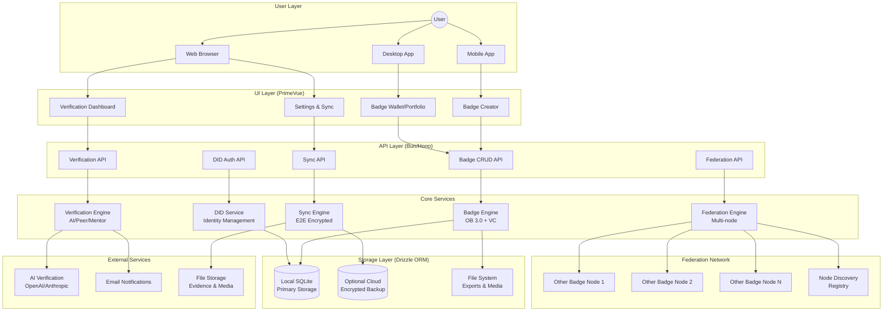
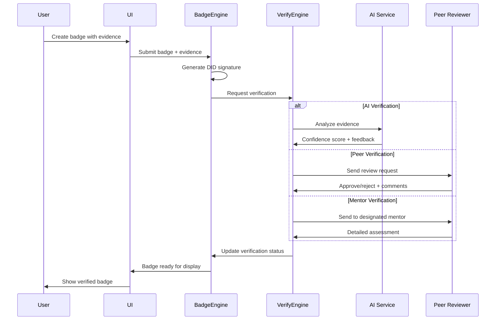
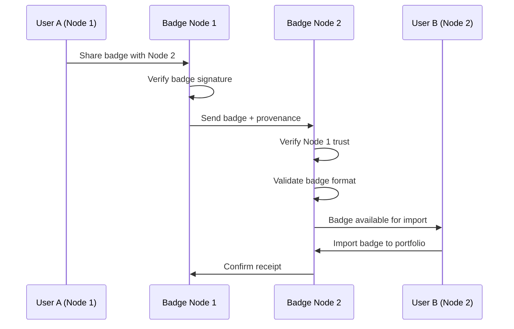

# Architecture Overview

**Context:** High-level system map for Rollercoaster.dev OpenBadges system
**Owner:** Joe
**Last Updated:** 2025-08-13

## System Architecture

## Core Components

### UI Layer (PrimeVue + Nuxt)
- **Badge Creator**: Wizard-style badge creation with evidence upload
- **Badge Wallet/Portfolio**: Grid and list views of earned badges
- **Verification Dashboard**: Review and validate badge evidence
- **Settings & Sync**: Privacy controls, sync configuration, export tools

### API Layer (Bun + Hono)
- **Badge CRUD API**: Create, read, update, delete badge operations
- **Verification API**: Evidence submission and review workflows
- **Sync API**: Optional encrypted synchronization across devices
- **Federation API**: Cross-node badge sharing and verification
- **DID Auth API**: Decentralized identity authentication

### Core Services
- **Badge Engine**: Open Badges 3.0 + Verifiable Credentials implementation
- **DID Service**: Identity management with did:key and did:web support
- **Verification Engine**: Pluggable verification (AI, peer review, mentor)
- **Sync Engine**: End-to-end encrypted multi-device synchronization
- **Federation Engine**: Multi-node badge network participation

### Storage Layer (Drizzle ORM)
- **Local SQLite**: Primary badge storage (local-first principle)
- **Optional Cloud**: Encrypted backup for multi-device access
- **File System**: Badge exports, evidence files, media attachments

## Verification Flows

### Self-Signed Badge Verification

### Federation Badge Exchange

## Wallet/Backpack Integration

### Badge Storage Format
- **Primary**: Open Badges 3.0 JSON-LD with Verifiable Credentials
- **Backup**: Open Badges 2.0 JSON for compatibility
- **Export**: PDF certificates, PNG images, CSV summaries
- **Metadata**: Creation date, verification status, evidence links

### Portfolio Features
- **Grid View**: Visual badge display with filtering and search
- **Detail View**: Full badge information, evidence, verification history
- **Collections**: User-organized badge groupings (skills, projects, etc.)
- **Sharing**: Public portfolio URLs, social media integration
- **Analytics**: Badge earning patterns, skill development tracking

## Data Flow Patterns

### Local-First Operations
1. **Create**: Badge created and stored locally immediately
2. **Sync**: Background sync to optional cloud storage (encrypted)
3. **Export**: Always available regardless of network status
4. **Import**: From various formats (OB 2.0/3.0, PDF, etc.)

### Federation Operations
1. **Discovery**: Find relevant badge networks and issuers
2. **Trust**: Establish cryptographic trust with other nodes
3. **Exchange**: Share badges with provenance and verification
4. **Conflict**: Resolve competing badges through user choice + reputation

## Security Architecture

### Identity & Authentication
- **User Identity**: Self-sovereign DIDs (did:key for portability)
- **Node Identity**: Verifiable node credentials (did:web for discovery)
- **Badge Signatures**: Cryptographic proof of authenticity
- **Evidence Integrity**: Hash-based tamper detection

### Privacy Controls
- **Local Storage**: Encrypted at rest using device keychain
- **Sync Encryption**: End-to-end encryption with user-controlled keys
- **Selective Sharing**: Granular control over badge visibility
- **Data Minimization**: Only necessary data shared across nodes

## Open Questions & Technical Decisions

### Immediate Decisions Required
- **DID Method Selection**: did:key vs did:web vs did:ion for user identity
- **Evidence Storage**: Embedded in badge vs separate file references
- **Sync Conflict Resolution**: Last-writer-wins vs CRDT vs user choice
- **AI Verification Provider**: OpenAI vs Anthropic vs local models

### Medium-Term Architecture Questions
- **Federation Protocol**: Custom vs ActivityPub vs Matrix-based
- **Trust Scoring Algorithm**: Web-of-trust vs reputation-based vs hybrid
- **Mobile Strategy**: Native apps vs PWA vs hybrid approach
- **Offline Sync**: How to handle long-term offline badge creation

### Long-Term Strategic Questions
- **Blockchain Integration**: For immutable badge records or trust networks
- **Enterprise Features**: SSO, bulk badge management, analytics dashboards
- **Monetization**: Premium sync, advanced verification, white-label licensing
- **Standards Evolution**: Influence on Open Badges 4.0 specification

## Performance & Scalability

### Local Performance Targets
- **Badge Creation**: <2 seconds end-to-end
- **Portfolio Loading**: <500ms for 1000+ badges
- **Search**: <100ms for local badge search
- **Export**: <5 seconds for full portfolio export

### Federation Performance
- **Node Discovery**: <3 seconds to find relevant nodes
- **Badge Verification**: <10 seconds cross-node verification
- **Sync Operations**: <30 seconds for full portfolio sync
- **Conflict Resolution**: <1 minute for user-guided resolution

## Deployment Architecture

### Single-Node Deployment
- **Development**: Local Bun server + SQLite + file storage
- **Production**: VPS with Docker + PostgreSQL + S3-compatible storage
- **Self-Hosted**: Docker Compose with backup automation

### Federation Network
- **Node Registry**: Distributed discovery service
- **Health Monitoring**: Cross-node connectivity and performance
- **Load Balancing**: Geographic distribution for performance
- **Backup Strategy**: Cross-node badge replication for resilience

## Sources & References

**Technical Specifications:**
- [Open Badges 3.0 Specification](https://www.imsglobal.org/spec/ob/v3p0/) — credential format standard
- [W3C Verifiable Credentials Data Model](https://www.w3.org/TR/vc-data-model-2.0/) — trust framework
- [W3C DID Core Specification](https://www.w3.org/TR/did-core/) — decentralized identity
- [Local-first Software Principles](https://www.inkandswitch.com/essay/local-first/) — Ink & Switch research

**Related Documentation:**
- [ADR-0001: Self-Signed Badges](../decisions/ADR-0001-self-signed-badges.md) — core badge model
- [ADR-0002: Local-First Optional Sync](../decisions/ADR-0002-local-first-optional-sync.md) — storage approach
- [ADR-0003: Federation Core Architecture](../decisions/ADR-0003-federation-core-architecture.md) — multi-node design
- [Vision: Now/Next/Later](../vision/now-next-later.md) — strategic context
- [2025 Q3 Roadmap](../roadmap/2025-Q3.md) — implementation timeline
